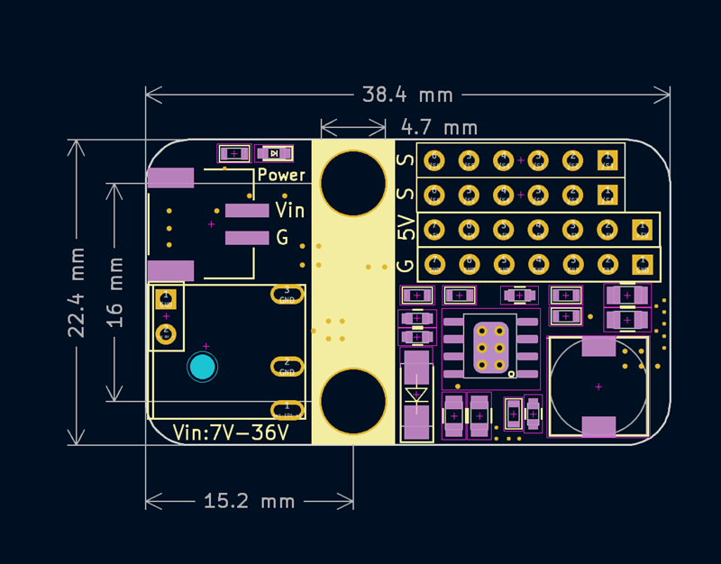

# PM01 5V5A Power Supply Module for Servo

## Product Image

## Introduction

This PM01 Power Supply Module is a 5V 5A step-down converter based on SY8205 chip. It accepts a wide input voltage from 6V to 30V and features flexible power inputs, including both a PH2.0 interface and a DC power jack.

The module's main purpose is to serve as a power source for high-current servo motor drive expansion. However, its stable 5V output also makes it suitable for powering various other devices and applications that require a robust 5V supply.

## Module Specifications

- Power Input: PH2.0 interface and 5.5 - 2.1mm DC jack input.
- Output: Maximum current of 5V 5A, capable of connecting up to 6 servo channels.
- Module Dimensions: 38.4mm x 22.4mm.
- Mounting: Fixed using M4 screws (hole diameter 4.7mm).

## How to Use

- G V S Pins: The G V S pins can be directly connected to a standard 3-pin plug-in servo motor. (G = Ground, V = Voltage/Power, S = Signal)
- Independent S Pin: The independent S (Signal) pin serves as the control signal input for an external microcontroller (MCU).
- Power Requirement: When using this power module with an external microcontroller for control, it is essential that the power module's power source and the main controller's power source are connected and share a common ground (common power connection).

## Size

